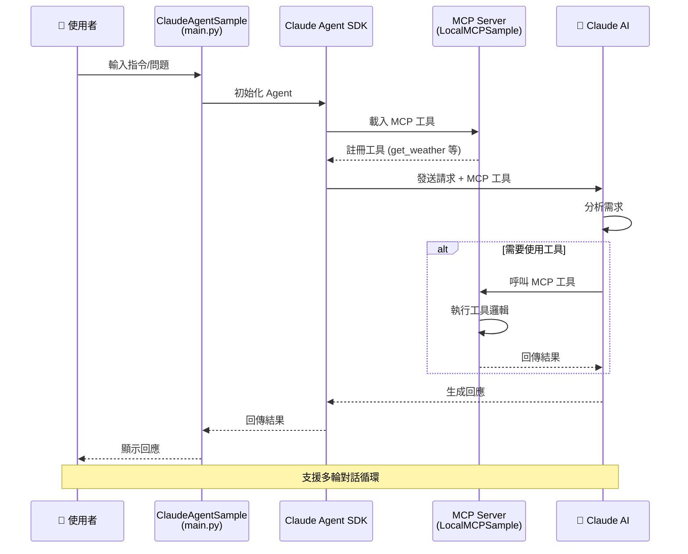
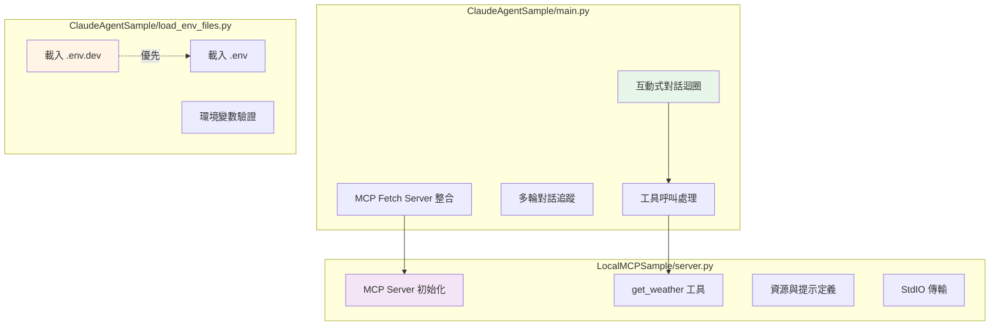

# ClaudeAgentSample 專案結構圖

## 資料流向



## 詳細目錄結構

```
ClaudeAgentSample/
├── 📄 CLAUDE.md                                # 通用開發指引
├── 📄 README.md                                # 方案說明文件
├── 📄 .gitignore                               # Git 忽略設定
├── 📊 The Agentic AI Simple Stack.pptx         # 簡報檔案
│
├── 📁 .claude/                                 # Claude Code 配置
│   ├── 📄 settings.local.json                  # 本地設定
│   └── 📁 agents/                              # 自訂 Agent
│       ├── 📄 code-reviewer.md                 # 程式碼審查專家
│       ├── 📄 data-scientist.md                # 資料科學專家
│       ├── 📄 debugger.md                      # 除錯專家
│       ├── 📄 prd-writer.md                    # PRD 撰寫專家
│       ├── 📄 steering-architect.md            # 專案架構師
│       ├── 📄 strategic-planner.md             # 策略規劃師
│       └── 📄 task-executor.md                 # 任務執行器
│
├── 📁 ClaudeAgentSample/                       # Claude Agent SDK 應用
│   ├── 📄 pyproject.toml                       # 依賴: claude-agent-sdk, mcp, dotenv
│   ├── 📄 CLAUDE.md                            # 開發指引
│   ├── 📄 README.md
│   ├── 📄 .python-version                      # 3.14+
│   ├── 📄 requirements.txt
│   ├── 📄 uv.lock
│   ├── 🔧 .env                                 # 基礎配置
│   ├── 🔧 .env.dev                             # 開發配置
│   ├── 🐍 main.py                              # 互動式 CLI 主程式
│   ├── 🐍 load_env_files.py                    # 環境變數載入
│   └── 📁 .venv/
│
└── 📁 LocalMCPSample/                          # MCP Server 範例
    ├── 📄 pyproject.toml                       # 依賴: mcp, aiohttp
    ├── 📄 README.md
    ├── 📄 .python-version                      # 3.14+
    ├── 📄 uv.lock
    ├── 🐍 main.py                              # Server 啟動入口
    ├── 🐍 server.py                            # MCP Server 實作 (get_weather)
    └── 📁 .venv/
```

## 核心功能模組


